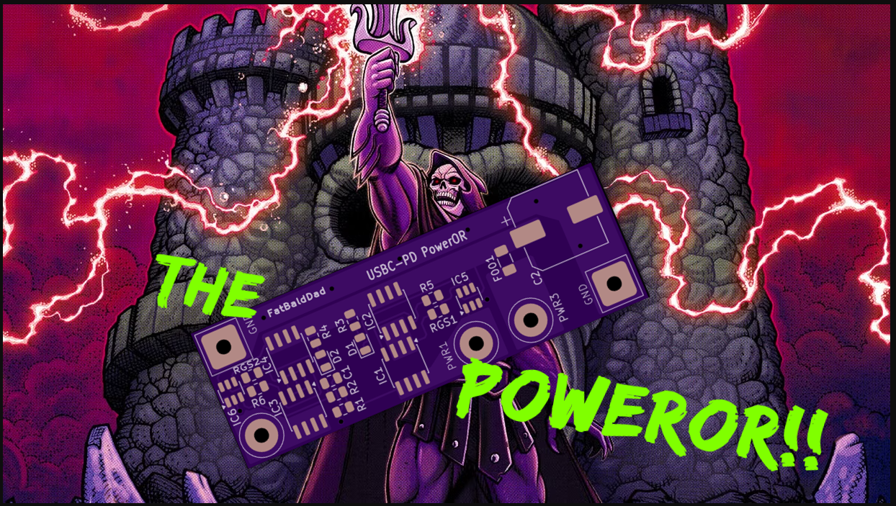

  

# PowerOR

PowerOR is an experimental power OR-ing project for PlayStation 2 Slim consoles.

The goal of this project is to explore a safer way to allow a PS2 Slim to use either the original OEM power supply or an alternate USB-C PD power source, while keeping the OEM power supply as the preferred/default option.

This project is currently experimental and should not be treated as a finished or proven power solution.

---

## What This Project Is

PowerOR is a prototype hardware project for testing dual-input power on a PlayStation 2 Slim.

The basic idea is:

- Keep the original PS2 OEM power input.
- Add an optional USB-C PD power input.
- Give the OEM power supply priority when it is connected.
- Prevent the OEM PSU and USB-C PD source from directly fighting each other.
- Provide a compact power board that may fit inside custom PS2 Slim builds.

This project is being developed for testing, documentation, and learning.

---

## What This Project Is Not

PowerOR is not a finished commercial product.

PowerOR is not a universal USB-C power mod for every PS2.

PowerOR is not intended for heavily modified consoles that draw significantly more current than a normal PS2 Slim.

This project is not currently recommended for consoles with high-power internal upgrades such as:

- RetroGEM
- Internal IDE interfaces
- Large internal storage setups
- High-current internal accessories
- Multiple power-hungry mods installed at the same time

If your console has several internal mods that increase power draw, this project may not be suitable without additional testing and a higher-current power design.

---

## Experimental Status

This project is experimental.

USB-C PD power mods for the PS2 are still a sensitive topic because poor power designs can damage consoles. Trigger boards, buck converters, wiring size, grounding, voltage stability, ripple, and current capacity all matter.

This project should be treated as a prototype until it has been properly tested.

Before using this in a console, the design needs to be tested for:

- Correct output voltage
- Proper USB-C PD negotiation
- Current handling
- Heat generation
- Voltage drop under load
- Ripple and noise
- Safe power-source switching
- OEM PSU priority behavior
- Long-term console stability

Do not assume this design is safe just because it powers on a console.

---

## Intended Use Case

PowerOR is mainly intended for lower-power PS2 Slim builds.

The best candidates are simpler builds that do not have a large number of power-hungry internal mods.

Possible intended use cases include:

- Lightly modified PS2 Slim consoles
- Ultra Slim style builds
- Consoles without the optical drive installed
- Builds using lower-current accessories
- Consoles where the OEM PSU option should remain available

The SCPH-790xx series may be one of the better candidates for this kind of testing because these boards generally use less power than earlier Slim models, especially when the optical drive is removed.

---

## Not Recommended For

At this stage, PowerOR is not recommended for heavy builds.

Avoid using this design on consoles with major power additions unless you fully understand the current requirements and have tested the power system properly.

Examples of builds that may require more power than this project is currently intended for:

- RetroGEM HDMI installs
- Internal IDE or hard drive interfaces
- Large internal SSD or HDD setups
- Multiple wireless modules
- Multiple internal converters
- Consoles with several active mods powered at the same time

Those builds may need a more robust power solution with higher current capacity, better thermal handling, and more complete protection.

---

## Design Goals

The goals of this project are:

- Preserve the original OEM power input
- Allow optional USB-C PD power
- Give OEM power priority
- Reduce the risk of backfeeding between power sources
- Keep the design compact
- Document the design clearly
- Test the design honestly
- Avoid presenting the board as finished before it is proven

---

## Safety Warning

This project modifies the power system of a PlayStation 2 console.

Incorrect voltage, unstable power, poor wiring, excessive current draw, or a bad USB-C PD setup can damage the console.

Use this information at your own risk.

This repository is for prototype development and documentation only.

---

## Current Status

Prototype / experimental.

This project is not finished, not fully tested, and not ready to be considered a proven install solution.

---

## Planned Testing

Planned testing includes:

- No-load voltage testing
- Dummy-load testing
- Current draw testing
- Thermal testing
- USB-C PD trigger testing
- OEM power priority testing
- Power switchover testing
- Console runtime testing
- Testing with different PS2 Slim board revisions

Test results will be added as the project develops.

---

## Disclaimer

PowerOR is an experimental hardware project.

I am documenting the idea, design, and testing process as I work through it. Nothing in this repository should be taken as a guarantee that the design is safe for every console or every build.

Do not install this in a valuable or heavily modified console without proper testing.
